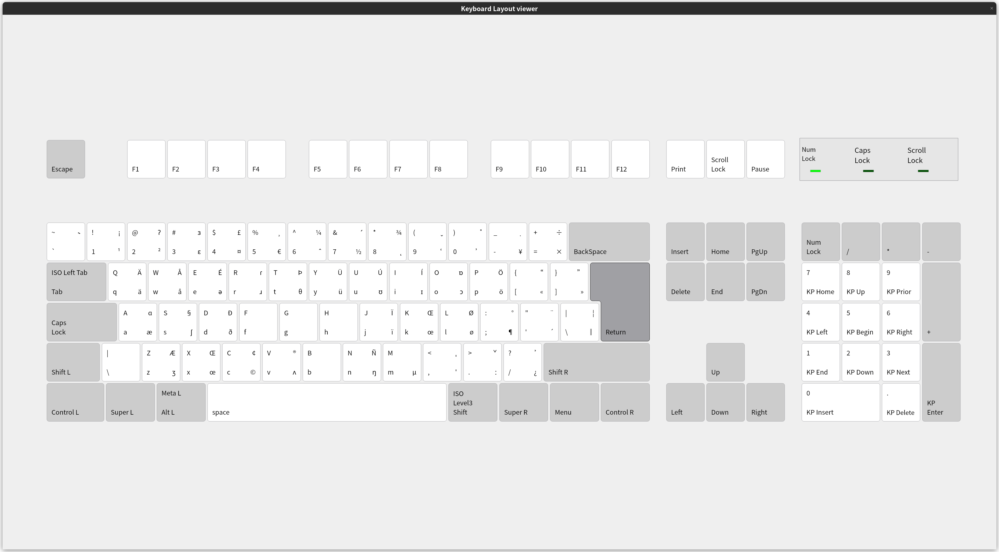

# IPA keyboard layout for XKB

IPA layout following https://ipa.typeit.org/.



## Installation

Clone this repository:

```
git clone https://github.com/fky2015/xkb-ipa
cd xkb-ipa
```

> **Warning**
> Please backup your file before editing.

Append the `us-intl.ipa` to the `/usr/share/X11/xkb/symbols/us`.

Add the following into the appropriate section of `/usr/share/X11/xkb/rules/evdev.xml`:

```XML
...
  <layoutList>
    <layout>
      <configItem>
        <name>us</name>      
        <shortDescription>en</shortDescription>
        <description>English (US)</description>
        <languageList>
          <iso639Id>eng</iso639Id>
        </languageList>
      </configItem>
      <variantList>
...

<!-- add here -->
        <variant>
          <configItem>
            <name>ipa</name>
            <description>English (US, intl., with dead keys for IPA overlay)</description>
          </configItem>
        </variant>
<!-- -------- -->

...
      </variantList>
    </layout>
```

Add the following contents into the appropriate sections of `/usr/share/X11/xkb/rules/evdev.lst`:

```
! variant
  intl            us: English (US, intl., with dead keys)
...
  ipa             us: English (US, intl., with dead keys for IPA overlay)
...
```

## Credits

- https://github.com/frekky/xkb-ipa
- https://ipa.typeit.org/
- https://util.unicode.org/UnicodeJsps/list-unicodeset.jsp
- https://github.com/junegunn/vim-easy-align
